# HB-DIS-EP-42 

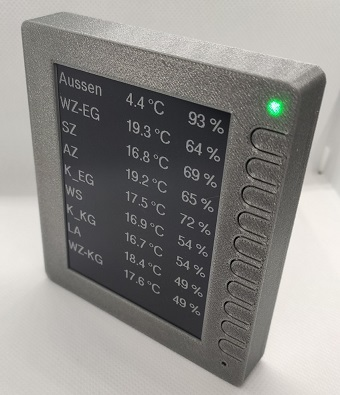 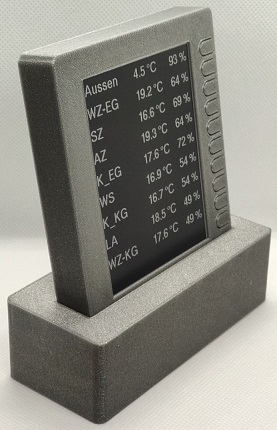

Die Infos hier beziehen sich auf Jérômes Projekt ePaper Display HB-Dis-EP-42BW  
[Original HB-Dis-EP-42BW](https://github.com/jp112sdl/HB-Dis-EP-42BW)

Support thread: https://homematic-forum.de/forum/viewtopic.php?f=76&t=61624

## Danke an  

Marco (stan23) für das ursprüngliche Leiterplattendesign welches Ausgangspunkt für diese Variante war  
papa für die Bereitstellung der AskSinPP Library  
TomMajor für die guten Tipps und den genialen Script-Helper  
Jérôme für Alles ;-)  

# Warum noch eine Variante?
Einerseits hat sich das e-Paper-Display von Waveshare geändert (Rev.2.1) und ich  wollte eine Gehäusevariante für die Wandmontage haben.
Hier hätten normale AA Batterien zu viel Platz beansprucht und das Gehäuse wäre entweder zu dick
oder zu lang geworden. Also musste eine Lösung mit Li-Po Akku her.

Außerdem hat man mehrere Möglichkeiten zur Stromversorgung  

- AA/AAA Batterien oder Akkus mit/ohne Stepup Regler  
- Li-Po Akku  
- Netzbetrieb mit 5V Netzteil  über Micro-USB Buchse  

Während des Ladevorgangs leuchten beide Leds (Duoled) solange bis der Akku vollgeladen ist. 

# Sketch  
Die Firmware stammt von Jérôme und wurde nur durch den Teil für den Li-Po Akku erweitert.  
Dazu einfach im Code  
`#define LIPO`  
auskommentieren. (Standard ist bereits auskommentiert)  
Für die Varianten ohne Li-Po kann man wahlweise auch die originale Version von Jérôme laden.    
https://github.com/jp112sdl/HB-Dis-EP-42BW/blob/master/HB-Dis-EP-42BW.ino

# Schaltung
[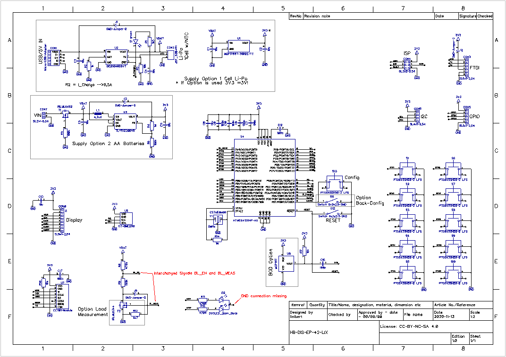](PCB/HB-DIS-EP-42-LIX_V1.0.pdf)  
In der ersten Version gibt es leider noch 2 Fehler im Schaltplan (rot markiert) ,  
die sich jedoch auf der Platine sehr leicht beheben lasssen.  
Die beiden Signale um die Batteriespannung zu messen (BL_EN und BL_MEAS) sind vertauscht.  
Auf der Platine muß daher R8 (470k) und R9 (100k) etwas anders bestückt werden.  
Lötjumper J5 muß geschlossen werden.  

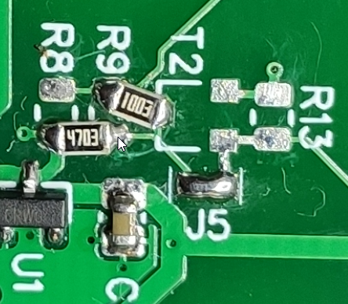  
Bei der Duoled fehlt die Masseanbindung. Dazu muß nur etwas Lötstopplack weggekratzt werden  
und mit Lötzinn verbunden werden.  
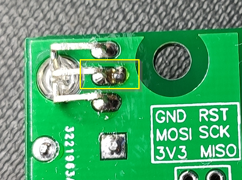  
Bei Bedarf werde ich die Daten noch bereinigen und eine neue Version erstellen.  
Zur Zeit habe ich jedoch noch einige Leiterplatten vorrätig, so dass da für mich keine Notwendigkeit  besteht.  

# Platine  
[**Gerberdaten**](PCB/HB-DIS-EP-42-LIX_gerberx2.zip)  
[**Stückliste**](PCB/Stückliste_HB-DIS-EP-42_V1.0.pdf)  

[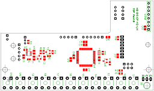](PCB/Assembly_Top_V1.0.pdf)  

[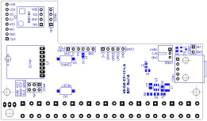](PCB/Assembly_Bottom_V1.0.pdf)  

# Mechanik
Das Gehäuse besteht  aus einem [Frontrahmen](Mechanik/Frontrahmen.stl) in welchem die Leiterplatte mit dem  Display eingeklebt wird  
und aus einer [Rückwand](Mechanik/Rückwand.stl) die einfach auf den Frontrahmen geclipst wird.  
Auf die Innenseite der Rückwand können z. B. auch Magnete geklebt werden.  
In meinem Fall befindet sich eine Holzkonsole an der Wand, in die ebenfalls Magnete eingklebt wurden.  
Somit kann man das Display sowohl als Tischmodel, als auch an der Wand benutzen.   

Zusätzlich gibt es noch einen [Sockel](Mechanik/Sockel.stl) mit [Batteriefach](Sockelverschluss.stl) an der Unterseite.  
Es gibt die Möglichkeit im Frontrahmen und am Sockel Magnete (10x5x2mm) einzukleben.  
Damit sitzt das Display dann fest im Sockel.  
Der Sockel wird für die Variante mit AA/AAA Batterien zwingend benötigt, da nur hier genug Platz für die Batteriebox ist.  
Die max. Abmessungen für eine Batteriebox sind l/b/h = 114 x 44 x 20mm.  
Somit ist eine Montage an der Wand nur mit Li-Po Akku möglich.  

# Aufbau  
**Wichtig! Display und Platine erst nach der Verschraubung verlöten**  
Das Display wird mit der Platine mit 2 Senkkopfschrauben M3x10 verschraubt.  
Wichtig ist, das der Abstand zwischen Display und Platine 2mm beträgt, damit die Taster bündig mit dem Frontrahmen sind!  
Die Schrauben sollten noch nicht ganz fest angezogen werden.  

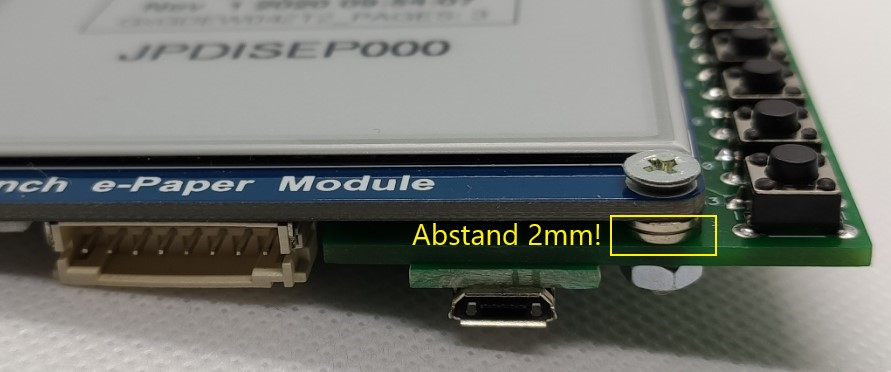  

Nun werden die 2 Magnete in den Frontrahmen an die Unterseite geklebt.  

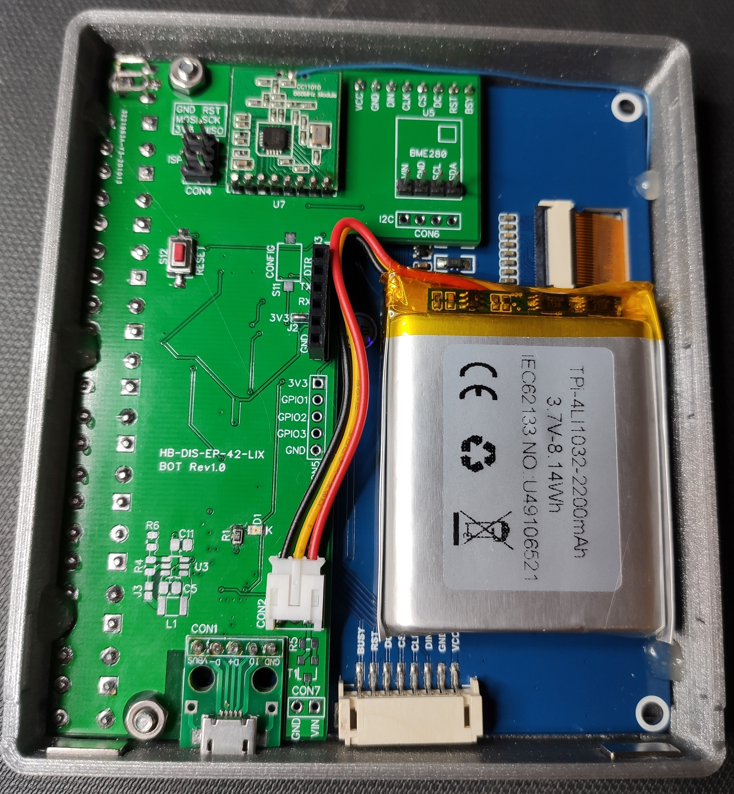  

Dannn die Einheit in den Frontrahmen setzen und darauf achten dass das Display bündig mit der Vorderseite abschliesst.  
Erst jetzt werden die beiden M3 Muttern angezogen. Das Display kann danach mit der Platine verlötet werden.  
Anschliessend wird die Displayeinheit noch mit Heisskleber im Frontrahmen fixiert.  
Der Li-Po wird mit Montageklebeband auf das Display geklebt.  
Das Klebeband sollte mindestens 1mm Stärke haben, damit die Bauteile am Display nicht beschädigt werden.  

Jetzt noch 2 Magnete in den Sockel einkleben,  

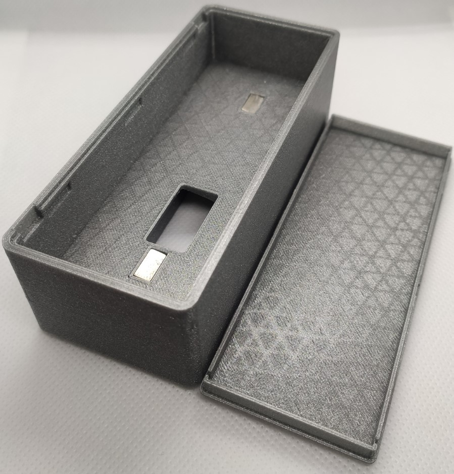  

und bei Bedarf noch zusätzliche Magnete in die Rückwand kleben.  

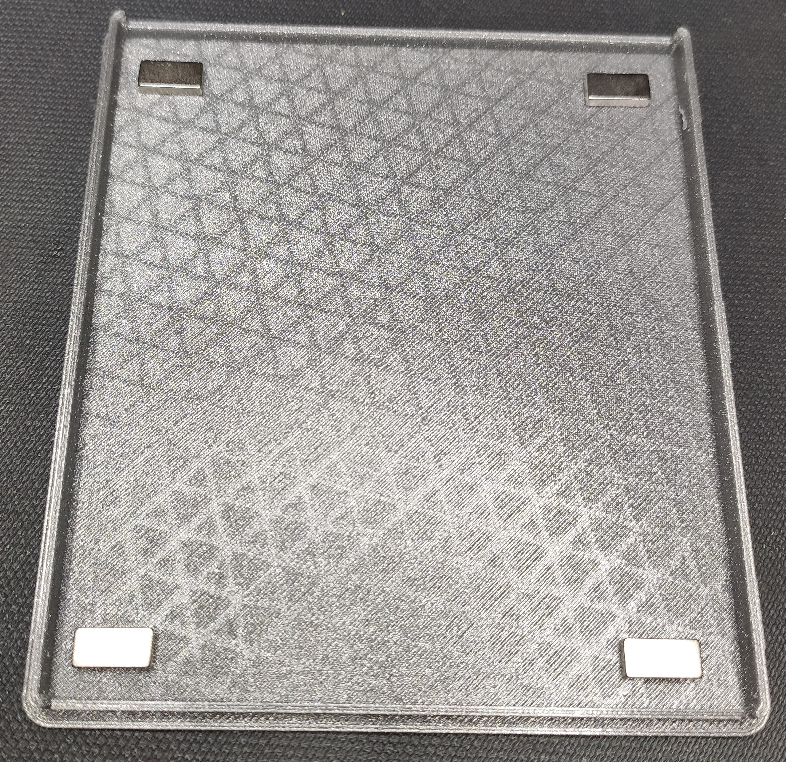  

# Zusätzliches Material

ein paar Magnete  10x5x2mm (benötigt werden min. 4 Stk.) z. B. https://www.amazon.de/First4magnets-F1052-10-Neodym-Magnete-ziehen-Packung/dp/B010DOW2OO/  
Li-Po Akku z.B. https://www.ebay.de/itm/LiPo-Polymer-Li-Ion-Akku-3-7V-2200mAh-54x42x8-5mm-JST-PH-3-Elektronik-NTC/324239268082?hash=item4b7e2a98f2:g:A4MAAOSwEUJfibQ0  
2 x M3x10 Senkkopfschrauben  
2 x Mutter M3  
2 x Abstandhalter 2mm  
4,2 Zoll E-ink Display https://de.aliexpress.com/item/32967154643.html?spm=a2g0s.9042311.0.0.27424c4dhfQJNQ oder  
https://www.amazon.de/Waveshare-Kommunikation-Schnittstelle-Aufl%C3%B6sung-Embedded-Controller/dp/B074NR1SW2  

# Kommt noch was?  
zur Zeit laufen gerade Versuche mit Qi Wireless Charging.  

